### Part 1. Настройка **gitlab-runner**

`-` Раз ты решил заняться CI/CD, должно быть, ты очень-очень любишь тестировать. Я тоже это люблю. Так что приступим. Если тебе потребуется какая-либо информация, рекомендую искать ответы в официальной документации.

**== Задание ==**

##### Подними виртуальную машину *Ubuntu Server 22.04 LTS*.
*Будь готов, что в конце проекта нужно будет сохранить дамп образа виртуальной машины.*<br>
```Поднял машину в Virtual Box, настроил тип соединения "Сетевой мост"```<br>
```Далее sudo apt install openssh-server```<br>
```Далее со своей машины подключился по ssh: ssh rachellt@<мой Ip>```<br>

##### Скачай и установи на виртуальную машину **gitlab-runner**.
```curl -L "https://packages.gitlab.com/install/repositories/runner/gitlab-runner/script.deb.sh" | sudo bash```<br>
```sudo apt install gitlab-runner```

##### Запусти **gitlab-runner** и зарегистрируй его для использования в текущем проекте (*DO6_CICD*).
- Для регистрации понадобятся URL и токен, которые можно получить на страничке задания на платформе.
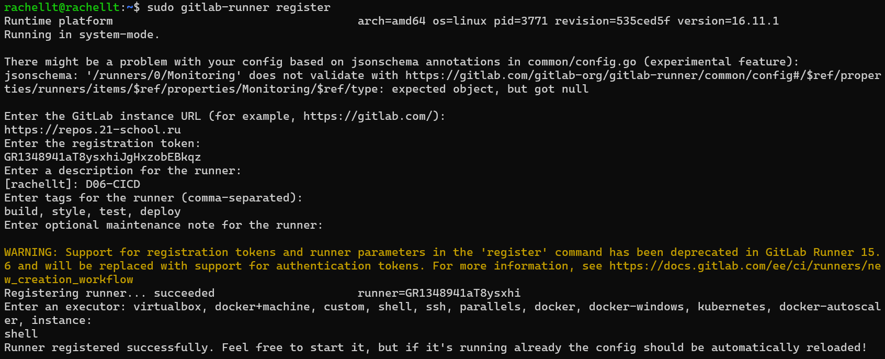
```запустить можно через sudo gitlab-runner run / sudo gitlab-runner start```

### Part 2. Сборка

`-` Предыдущее испытание было создано, чтобы повышать в людях уверенность в себе.
Теперь я подкорректировала тесты, сделав их более сложными и менее льстивыми.<br>
```На виртуалке:```<br>
```ssh-keygen -t rsa и положить в гитлаб```<br>
```git clone <SimpleBashUtils>```
```git clone <CICD>```<br>
```Удалил src в CICD и скопировал из SimpleBash: cp -r src ../D06-CICD```<br>
```Далее в D06-CICD: touch .gitlab-ci.yml и vim gitlab-ci.yml```<br>

**== Задание ==**

#### Напиши этап для **CI** по сборке приложений из проекта *C2_SimpleBashUtils*.
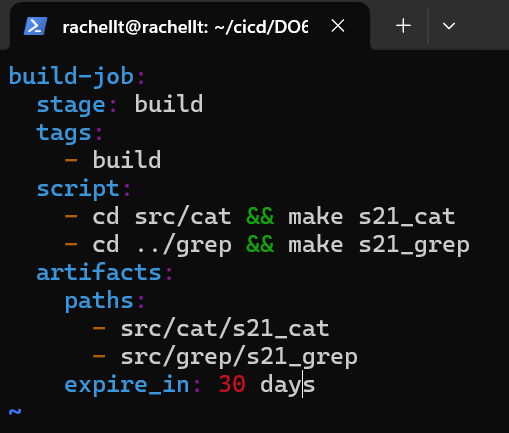<br>
```До пуша в репу обязательно: sudo apt install gcc, sudo apt install make```<br>
```Если не указать тег - пайплайн зависнет с флагом stuck, можно указать default```<br>
```Чтобы проверить, что раннер запущен: sudo gitlab-runner status```<br>
```Далее по базе git add, git commit, git push.```<br>
##### В файле _gitlab-ci.yml_ добавь этап запуска сборки через мейк файл из проекта _C2_.

##### Файлы, полученные после сборки (артефакты), сохрани в произвольную директорию со сроком хранения 30 дней.
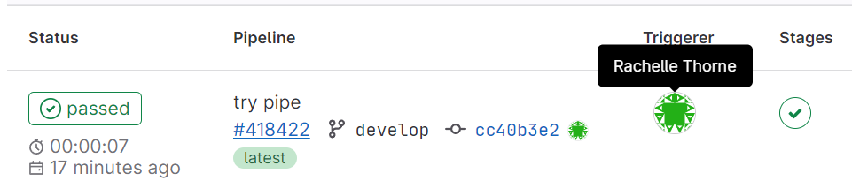<br>

### Part 3. Тест кодстайла

`-` Поздравляю, ты выполнил абсолютно бессмысленную задачу. Шучу. Она была нужна для перехода ко всем последующим.

**== Задание ==**<br>
```sudo apt install clang-format```<br>

#### Напиши этап для **CI**, который запускает скрипт кодстайла (*clang-format*).
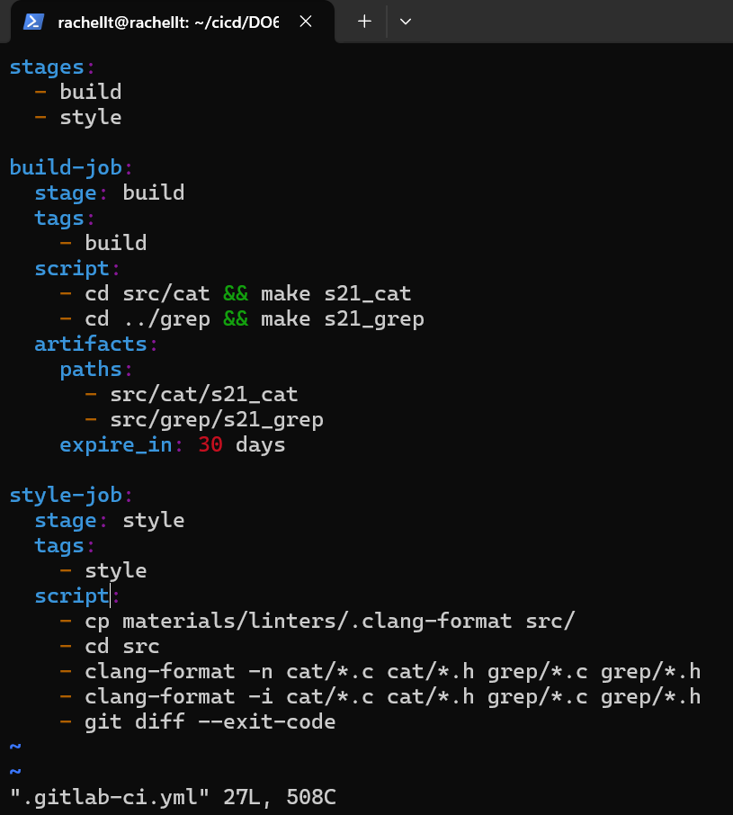<br>
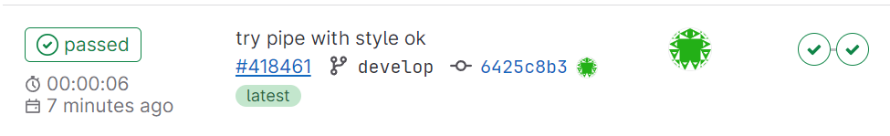<br>
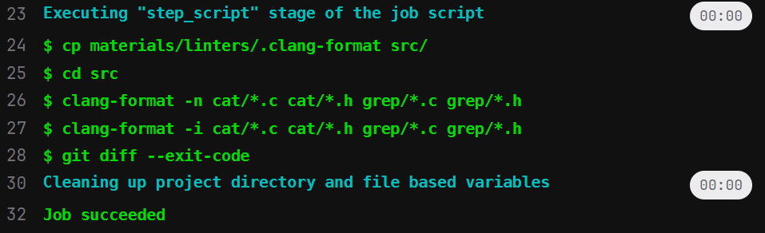<br>
##### Если кодстайл не прошел, то «зафейли» пайплайн.
```Запускаю кланг-козявку в s21_cat.c```
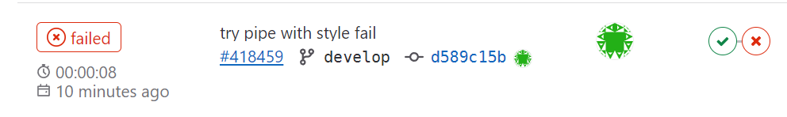<br>
```шкибиди фейл```
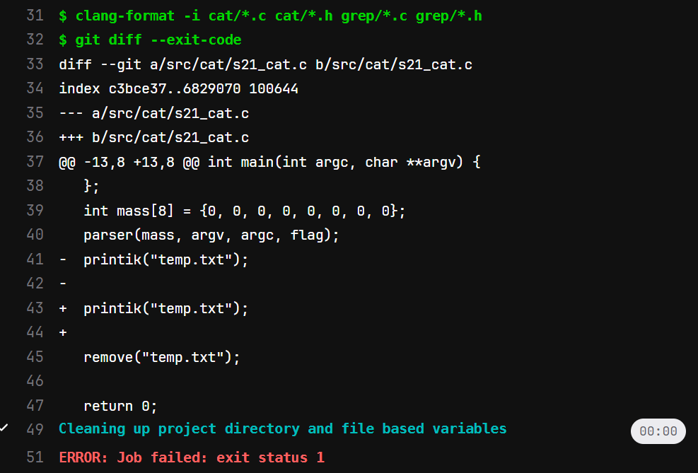<br>
##### В пайплайне отобрази вывод утилиты *clang-format*.

### Part 4. Интеграционные тесты

`-` Отлично, тест на кодстайл написан. [ТИШЕ] Говорю с тобой тет-а-тет. Не говори ничего коллегам. Между нами: ты справляешься очень хорошо. [ГРОМЧЕ] Переходим к написанию интеграционных тестов.

**== Задание ==**

#### Напиши этап для **CI**, который запускает твои интеграционные тесты из того же проекта.
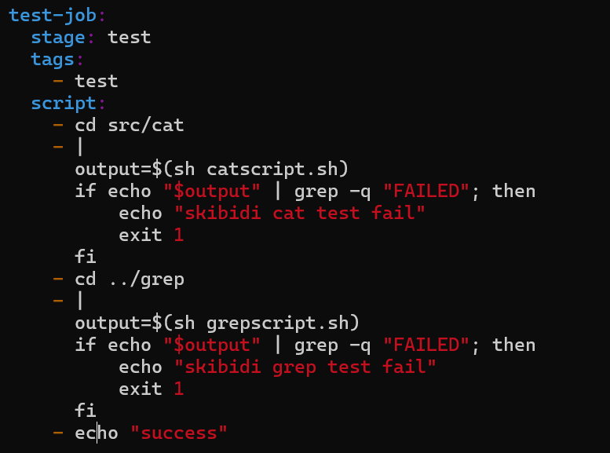<br>
##### Запусти этот этап автоматически только при условии, если сборка и тест кодстайла прошли успешно.
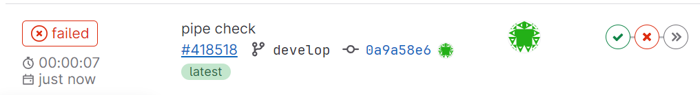

##### Если тесты не прошли, то «зафейли» пайплайн.
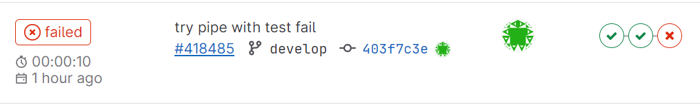<br>
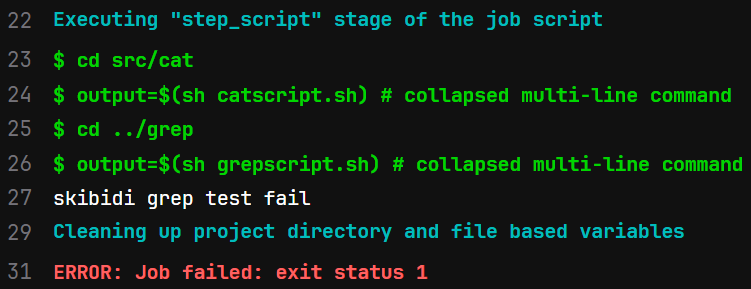<br>
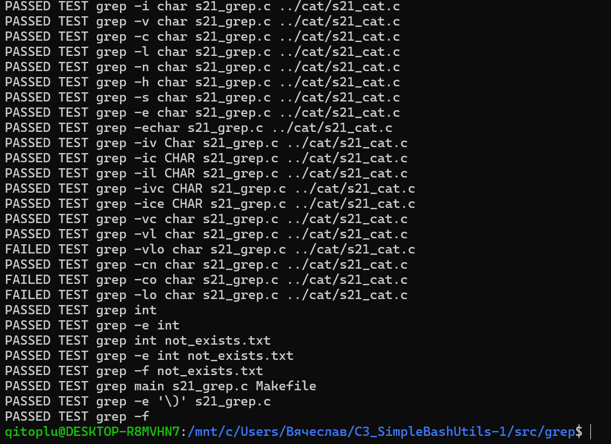<br>
```удачный вариант```<br>
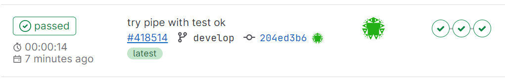<br>
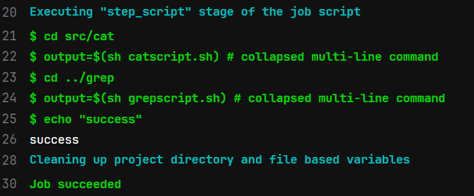<br>
<br>
### Part 5. Этап деплоя

`-` Для завершения этого задания ты должен перенести исполняемые файлы на другую виртуальную машину, которая будет играть роль продакшна. Удачи.

**== Задание ==**

##### Подними вторую виртуальную машину *Ubuntu Server 22.04 LTS*.
```
На первой машине rachellt: 
sudo su gitlab-runner
ssh-keygen -t rsa
ssh-copy-id slavka@192.168.1.92
ssh slavka@192.168.1.92
ключ так же в гитлаб добавил

На второй машине slavks:
ssh-keygen -t rsa
ssh-copy-id rachellt@192.168.1.90
ssh rachellt@192.168.1.90
```

#### Напиши этап для **CD**, который «разворачивает» проект на другой виртуальной машине.
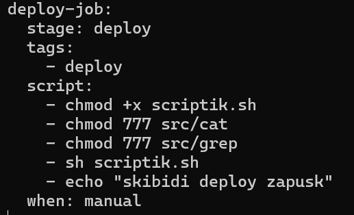<br>
##### Запусти этот этап вручную при условии, что все предыдущие этапы прошли успешно.

##### Напиши bash-скрипт, который при помощи **ssh** и **scp** копирует файлы, полученные после сборки (артефакты), в директорию */usr/local/bin* второй виртуальной машины.
*Тут тебе могут помочь знания, полученные в проекте DO2_LinuxNetwork.*

- Будь готов объяснить по скрипту, как происходит перенос.
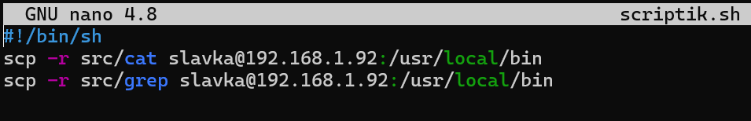<br>
##### В файле _gitlab-ci.yml_ добавь этап запуска написанного скрипта.

##### В случае ошибки «зафейли» пайплайн.

В результате ты должен получить готовые к работе приложения из проекта *C2_SimpleBashUtils* (s21_cat и s21_grep) на второй виртуальной машине.

##### Сохрани дампы образов виртуальных машин.
**P.S. Ни в коем случае не сохраняй дампы в гит!**
- Не забудь запустить пайплайн с последним коммитом в репозитории.
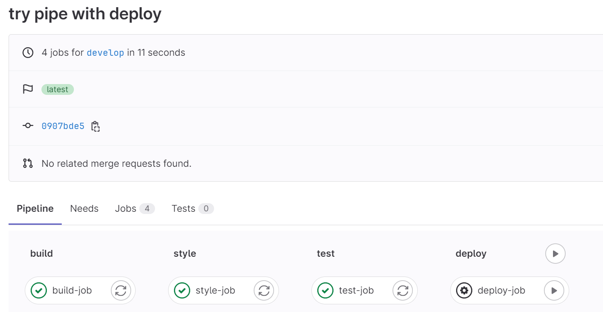<br>
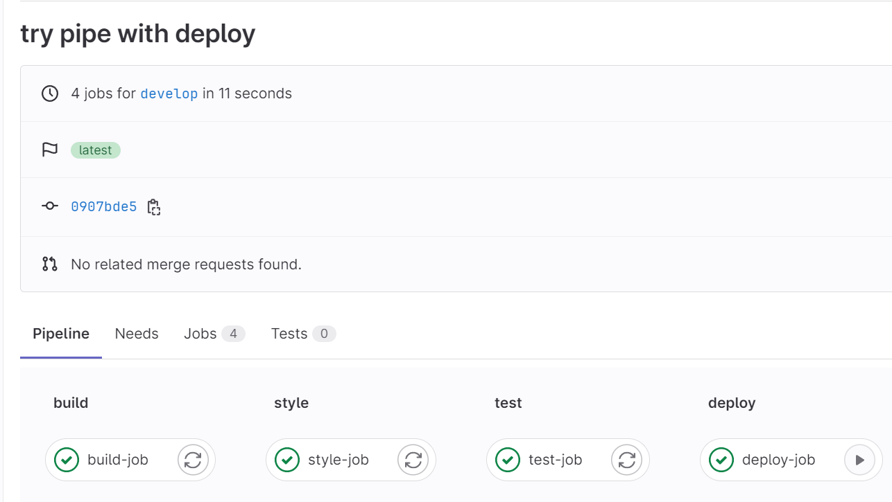<br>
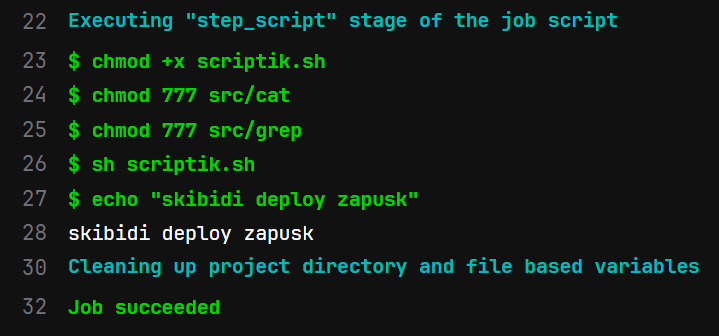<br>
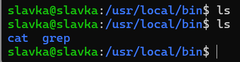<br>
### Part 6. Дополнительно. Уведомления

`-` Здесь написано, что твое следующее задание выполняется специально для нобелевских лауреатов. Здесь не сказано, за что они получили премию, но точно не за умение работать с **gitlab-runner**.

**== Задание ==**

##### Настрой уведомления о успешном/неуспешном выполнении пайплайна через бота с именем «[твой nickname] DO6 CI/CD» в *Telegram*.
<br>
- Текст уведомления должен содержать информацию об успешности прохождения как этапа **CI**, так и этапа **CD**.
- В остальном текст уведомления может быть произвольным.


## Chapter IV

`-` Хорошо. По завершении серии заданий сотруднику следует пройти в комнату отдыха.

Пока у тебя выдалась свободная минутка в комнате отдыха, ты, попутно размышляя о странности происходящего, решаешь проверить почту.

Не успел ты достать телефон, как в комнату отдыха зашёл ещё один человек.

`-` Привет, что-то я тебя тут раньше не видел.

`-` Было бы странно, если бы видел. Я тут первый день, хах.

`-` О, первый день! Ну и как тебе наш «босс»? - последние слова прозвучали с явной иронией.

`-` Это был босс? Фух, всё-таки он не одному мне кажется странным... и слегка грубым? Я уж думал, что вы все в Англии такие.

`-` Ахах, ни в коем случае, друг. Это просто розыгрыш для новичков, но не волнуйся, завтра всё будет в порядке. Кстати говоря, вон идет и настоящий босс, кажется, как раз к тебе. Ну, удачи, свидимся еще.

Незнакомец быстро пропал и в комнату зашел невысокий мужчина в дорогом костюме, с небольшой залысиной, навскидку лет этак 50-60 лет. Не дожидаясь твоих слов, он с тонкой, едва уловимой улыбкой произнес:

`-` Ах, вы, видимо, Томас. Поистине великолепное выполнение тестовой работы. Надеюсь, вы не испугались нашей милой подруги ASI младшей, она высоко отозвалась о вас. Итак, позвольте мне подробнее рассказать чем мы тут вообще занимаемся и какова ваша роль в нашей компании...


💡 [Нажми сюда](https://forms.yandex.ru/cloud/641819b3c09c022518e7a4f3/), **чтобы поделиться с нами обратной связью на этот проек**т. Это анонимно и поможет команде Продукта сделать твоё обучение лучше.
